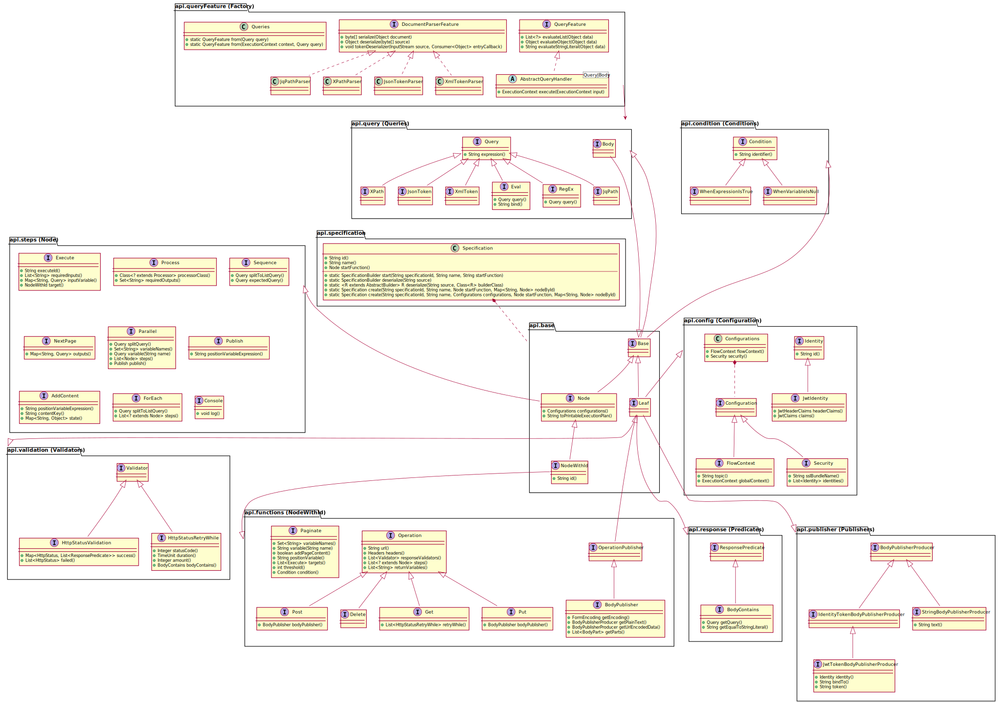
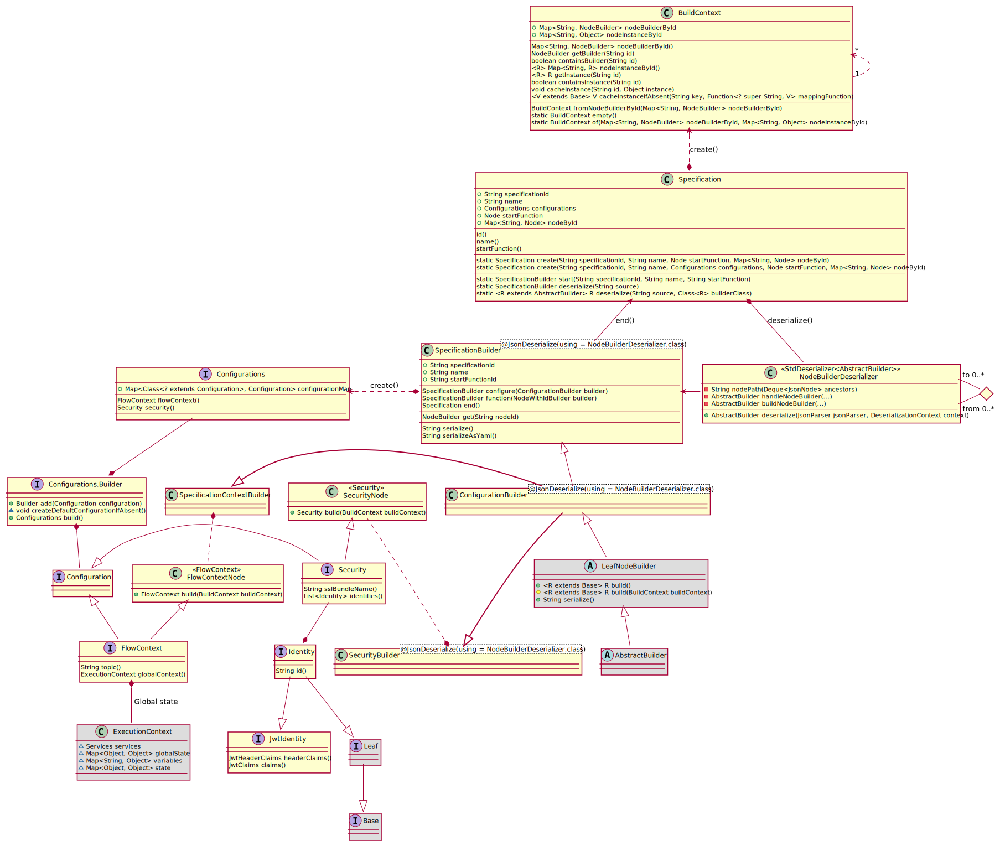

= Developer Guide

ifdef::env-github[]
:tip-caption: :bulb:
:note-caption: :information_source:
:important-caption: :heavy_exclamation_mark:
:caution-caption: :fire:
:warning-caption: :warning:
:toc-placement: preamble
endif::[]

== DSL

A bespoke Domain Specific Language (DSL) is implemneted for the Data Collector that

=== Base Builders

==== AbstractBuilder

The _AbstractBuilder_ is a common ancestor for all Builders.

==== NodeBuilder

The _NodeBuilder_ is used in conjunction with NodeWithId (a function).

=== Specification Builders

=== Configuration Builders

=== Function Builders

==== Pagination Builder

===== Condition Builder

==== Http Builders

===== Security Builders

===== Validation Builders

===== Response Builders

=== Step Builders

=== Query Builders

ifdef::env-github[]
== Domain Builder Class diagram

== Domain API Class diagram

== Domain Handler Class diagram
image::diagrams/dsl-handler-class-diagram.svg[alt="Domain Handler Class diagram", max-width=1024, link="diagrams/dsl-handler-class-diagram.svg"]

== Builder Class diagram
image::diagrams/builder-class-diagram.svg[alt="Builder Class Diagram", max-width=1024, link="diagrams/builder-class-diagram.svg"]

== Specification Builder Class diagram

endif::[]

ifndef::env-github[]
== Domain Builder Model Class diagram
plantuml::puml/dsl-builder-class-diagram.puml[format=svg, alt="Domain Builder Class diagram", max-width=1024, link="dsl-builder-class-diagram.svg"]

== Domain API Class diagram
plantuml::puml/dsl-api-class-diagram.puml[format=svg, alt="Domain Model API diagram", max-width=1024, link="dsl-api-class-diagram.svg"]

== Domain Handler Class diagram
plantuml::puml/dsl-handler-class-diagram.puml[format=svg, alt="Domain Handler Class diagram", max-width=1024, link="dsl-handler-class-diagram.svg"]

== Builder Class diagram
plantuml::puml/builder-class-diagram.puml[format=svg, alt="Builder Class Diagram", max-width=1024, link="builder-class-diagram.svg"]

== Specification Builder Class diagram
plantuml::puml/specification-builder-class-diagram.puml[format=svg, alt="Http Builder Class Diagram", max-width=1024, link="specification-builder-class-diagram.svg"]

endif::[]