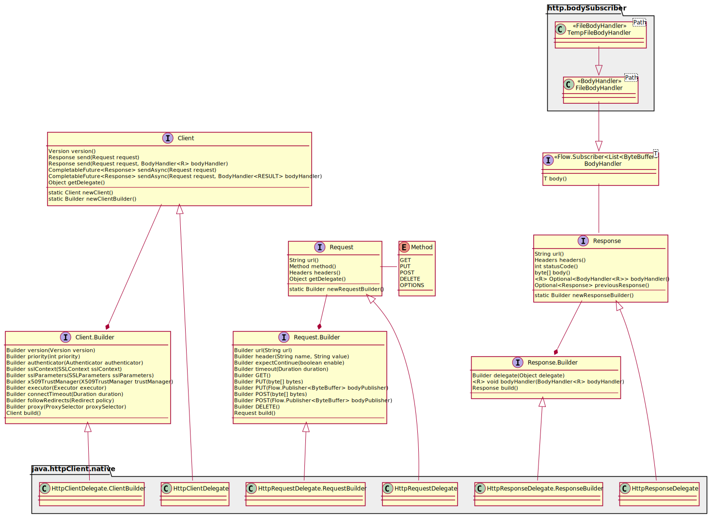

== Http Client

ifdef::env-github[]
:tip-caption: :bulb:
:note-caption: :information_source:
:important-caption: :heavy_exclamation_mark:
:caution-caption: :fire:
:warning-caption: :warning:
:toc-placement: preamble
endif::[]

=== Diagrams

ifdef::env-github[]

== HttpClient Class diagram

endif::[]

ifndef::env-github[]
== HttpClient Class diagram
plantuml::puml/http-client-class-diagram.puml[format=svg, alt="HttpClient Class Diagram", max-width=1024, link="http-client-class-diagram.svg"]
endif::[]
