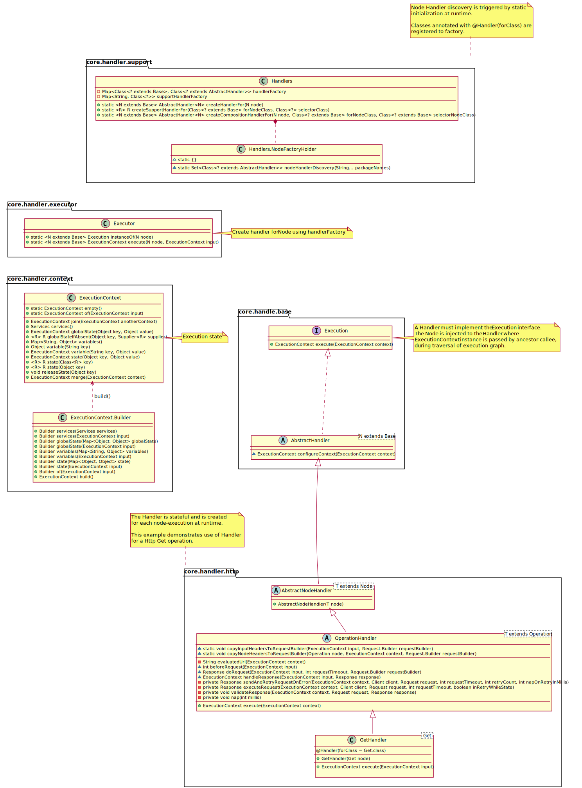
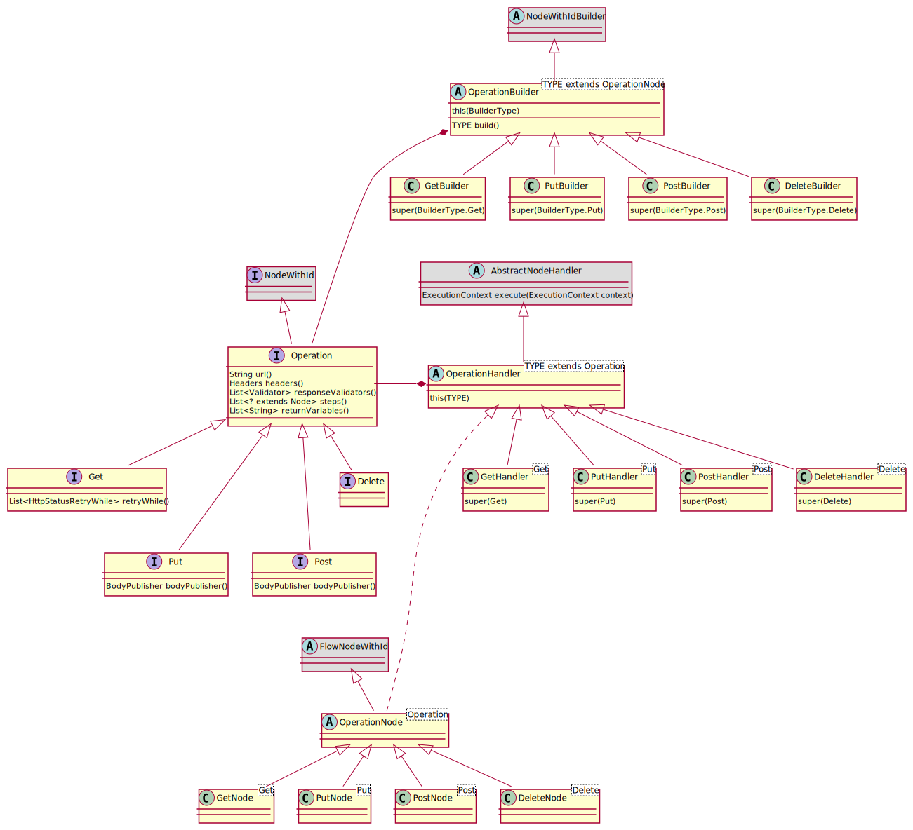

= Developer Guide

ifdef::env-github[]
:tip-caption: :bulb:
:note-caption: :information_source:
:important-caption: :heavy_exclamation_mark:
:caution-caption: :fire:
:warning-caption: :warning:
:toc-placement: preamble
endif::[]

== Diagrams

ifdef::env-github[]
== Domain Model Class diagram
image::diagrams/dsl-builder-diagram.svg[alt="Domain Builder Model Class diagram", max-width=1024, link="diagrams/dsl-builder-diagram.svg"]

== Domain Model Class diagram
image::diagrams/dsl-api-diagram.svg[alt="Domain Model Class diagram", max-width=1024, link="diagrams/dsl-api-diagram.svg"]

== Domain Handler Class diagram

== Builder Class diagram

== Specification Builder Class diagram
image::diagrams/specification-builder-class-diagram.svg[alt="Http Builder Class Diagram", max-width=1024, link="diagrams/specification-builder-class-diagram.svg"]

== Http Builder Class diagram

== HttpClient Class diagram
image::diagrams/http-client-class-diagram.svg[alt="HttpClient Class Diagram", max-width=1024, link="diagrams/http-client-class-diagram.svg"]

endif::[]

ifndef::env-github[]
== Domain Model Class diagram
plantuml::puml/dsl-api-diagram.puml[format=svg, alt="Domain Model Class diagram", max-width=1024, link="dsl-api-diagram.svg"]

== Domain Builder Model Class diagram
plantuml::puml/dsl-builder-diagram.puml[format=svg, alt="Domain Model Class diagram", max-width=1024, link="dsl-builder-diagram.svg"]

== Domain Handler Class diagram
plantuml::puml/dsl-handler-class-diagram.puml[format=svg, alt="Domain Handler Class diagram", max-width=1024, link="dsl-handler-class-diagram.svg"]

== Builder Class diagram
plantuml::puml/builder-class-diagram.puml[format=svg, alt="Builder Class Diagram", max-width=1024, link="builder-class-diagram.svg"]

== Specification Builder Class diagram
plantuml::puml/specification-builder-class-diagram.puml[format=svg, alt="Http Builder Class Diagram", max-width=1024, link="specification-builder-class-diagram.svg"]

== Http Builder Class diagram
plantuml::puml/http-builder-class-diagram.puml[format=svg, alt="Http Builder Class Diagram", max-width=1024, link="http-builder-class-diagram.svg"]

== HttpClient Class diagram
plantuml::puml/http-client-class-diagram.puml[format=svg, alt="HttpClient Class Diagram", max-width=1024, link="http-client-class-diagram.svg"]

endif::[]
