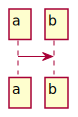

= REST API

ifdef::env-github[]
:tip-caption: :bulb:
:note-caption: :information_source:
:important-caption: :heavy_exclamation_mark:
:caution-caption: :fire:
:warning-caption: :warning:
:toc-placement: preamble
endif::[]

ifdef::env-github[]
== Sequence diagram

endif::[]

ifndef::env-github[]
== Sequence diagram
// plantuml::puml/rest-sequence-diagram.puml[format=svg, alt="Data Read Success", max-width=1024]

endif::[]

== Endpoints

=== Add task

Create new task given a serialized specification. If same specification is already running, it will be rejected.

*PUT /tasks*

*Parameters*

None.

*Headers*

[cols="h,2"]
|===
| content-type
| application/json
|===

*Request body*

Specification payload.

*Response codes*

[cols="h,2"]
|===
| 201
| Created new task
| 409
| Reject task. It is already running.
| 400
| Bad request. Probably not a PUT operation.
|===

=== Get tasks

Get task list of running workers.

*GET /tasks*

*Parameters*

None.

*Headers*

[cols="h,2"]
|===
| content-type
| application/json
|===

*Request body*

None.

*Response codes*

[cols="h,2"]
|===
| 200
| Resource found
|===

=== Cancel task

*DELETE /tasks/{workerId}*

Cancel a running task.

*Parameters*

[cols="h,2"]
|===
| workerId
| WorkerID to terminate.
|===

*Headers*

None.

*Request body*

None.

*Response codes*

[cols="h,2"]
|===
| 200
| Task terminated
| 400
| Unable to cancel task
|===

=== Get health

*GET /health*

Get health information.

*Parameters*

[cols="h,2"]
|===
| all
| Render all health resources
| config
| Render configuration
| contexts
| Render web server controller info

| runtime
| Render vm runtime info
| threads
| Render threads and stack-traces
|===

*Request body*

JSON payload.

*Response codes*

[cols="h,2"]
|===
| 200
| Resource found
|===

=== Get health alive

*GET /health/alive*

Check if server is responding.

*Parameters*

None.

*Headers*

None.

*Request body*

None.

*Response codes*

[cols="h,2"]
|===
| 200
| Resource found
|===

=== Get health ready

*GET /health/ready*

Check if server is healthy.

*Parameters*

None.

*Headers*

None

*Request body*

None.

*Response codes*

[cols="h,2"]
|===
| 200
| Everything seems good.
| 503
| Restart service is required.
|===

